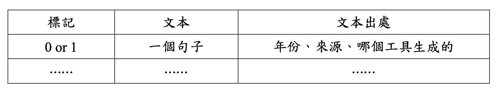
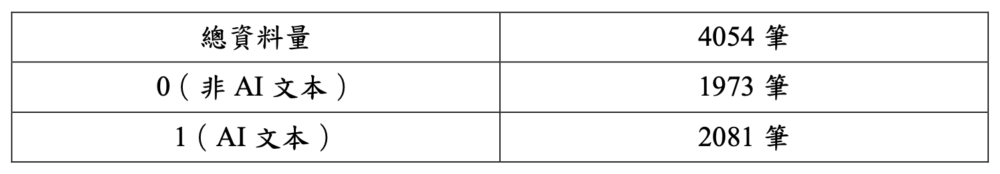
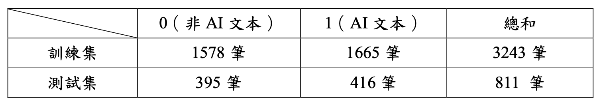
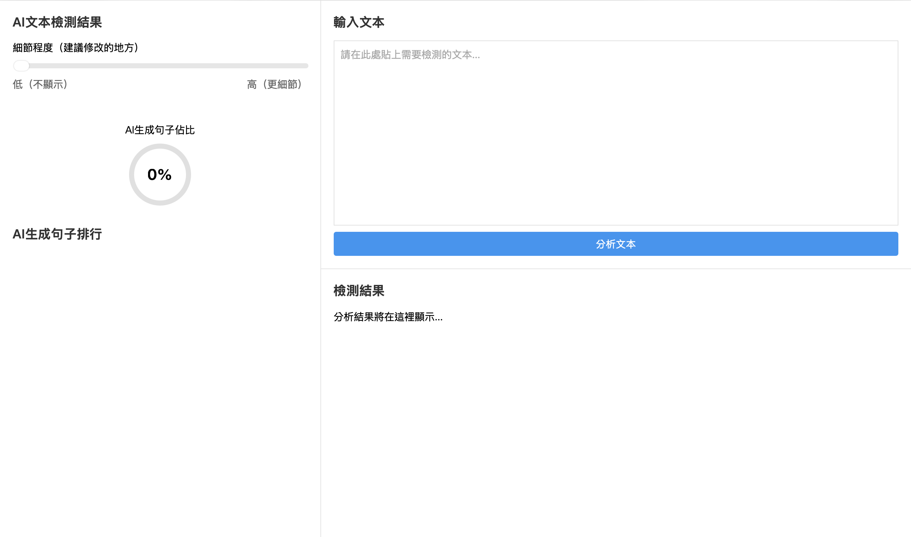

# ai-text-detector
A full-stack project for detecting AI-generated text. Includes data collection, preprocessing, model selection and training, backend deployment, and frontend interface.

## 資料收集

將 2010 年作為可信非 AI 生成資料的時間界線。

**非 AI 文本**：在 Google 搜尋引擎中使用「關鍵詞＋before:2010」的格式進行查找，找到符合的文章後近一步做處理，以句號做切分且確保每句皆無空格並以句號做結尾。每句標記為 0 (表示非 AI 生成) 存入 CSV 檔案中。

**AI 文本**：將上述找到的非 AI 文章丟入至各類 GPT 生成相似內容，以產出 AI 生成的對應文本，Prompt 大致格式為 :「整理以下並生成相似文章，不要有標題和列點，x 字左右：」一樣以句號做切分，每句標記為 1 (表示 AI 生成) 存入 CSV 檔案中。

**CSV 檔案格式**：

【註】範例請見 [sample1.csv](/data/sample1.csv)

**最終資料量**：

## 資料處理

資料單位為筆，以句號做切分，所以一個句子為一筆。在訓練集和測試集上我們以 8:2 做分割，為了讓各類別的比例和整體資料集中是一致的，有加入額外參數。實際資料量如下：

另外在訓練集中額外加入了詞性標註 (POS tagging)、依存句法分析 (Dependency Parsing) 以及 TF-IDF 關鍵詞萃取。

## 模型選擇

模型 1：ckiplab/bert-base-chinese，由中研院 (CKIP Lab) 開發的繁體中文基於 BERT 的預訓練模型。  

模型 2：hfl/chinese-macbert-base，來自哈爾濱工業大學與北京大學的研究團隊基於 MacBERT 的預訓練模型。  

模型 3：hfl/chinese-bert-wwm-ext，來自哈爾濱工業大學與北京大學的研究團隊經過改進的 Whole Word Masking (WWM) 做預訓練。  

模型 4：hfl/chinese-roberta-wwm-ext，由哈爾濱工業大學信息檢索研究中心 (HIT IRLab) 開發的一個基於 RoBERTa 的中文預訓練模型。 

模型 5：uer/chinese_roberta_L-12_H-768，來自中國的 UER (Unified Embedding Representation) 團隊，基於 RoBERTa 架構進行預訓練。

**訓練過程收斂情形**：  
不收斂：模型 5  
收斂過程波動：模型 3、模型 4  
穩定收斂：模型 1、模型 2  

最終選擇模型 1，雖然 evaluation loss 不是最低的，但 MCC、Accuracy、F1 Score 皆是最高的。

## 模型訓練

在 Google Colab 端運行。程式碼：[model.ipynb](/src/model.ipynb)。 

 `model.ipynb` 內容：
- 將預處理 (Data Preprocessing) 好的資料切分訓練集和測試集。
- 對訓練集做特徵工程 (Feature Engineering)，含詞性標註 (POS tagging)、依存句法分析 (Dependency Parsing) 以及 TF-IDF 關鍵詞萃取。
- 訓練模型並生成相關數據結果。
- 儲存模型。

## 前端介面

在本地端運行。程式碼：[frontend.html](/src/frontend.html)。 

`frontend.html` 內容：
- 將使用者貼上的文本以句號做切分，一句一句的丟入後端處理。
- 使用 Ngork 免費版連結前後端。

**網頁**：

## 後端部署

在 Google Colab 端運行。程式碼：[backend.ipynb](/src/backend.ipynb)。 

`backend.ipynb` 內容：
- 使用 Python Flask。
- 載入訓練好的模型執行 AI 生成文本的預測任務。
- 當文本被判別為 AI 生成時，會使用集成梯度法 (Integrated Gradients) 進一步計算每個詞元 (Token) 對此分類結果的貢獻度。
- 回傳預測結果 (0 or 1)、此句為 ai 生成的機率、此句的所有詞元對被判別為 1 (ai) 的貢獻度。

## 結果
詳細書面報告在 [report.pdf](report.pdf) 中。
